# From zero to heightmap: A full tutorial

:::warning
As of the date of these tutorials, the Editor for Cities: Skylines II is not officially supported. Use the Editor at your own risk. These tutorials are provided to give map makers the knowledge to gather and process the data for heightmaps when the Editor is officially supported. This tutorial will not cover importing of heightmaps in-game until the Editor is officially support by Colossal Order.
:::

Map data attribution: Map services and data available from U.S. Geological Survey, National Geospatial Program.

## Overview
This tutorial will walk through the process of creating the first iteration of a heightmap for Cities: Skylines II using QGIS 3.34.0-Prizen. By the end of this tutorial you will know how to:
- Add a geographic center point to your project that will be the center of your map in-game
- Create buffers for the total and playable map areas
- Download the minimum Digital Elevation Model (DEM) files needed for your map from USGS National Map download service
- Clip the DEM to sizes needed for the total and playable areas in-game
- Convert the DEM into a game-compliant file format
- Create an overlay using OpenStreetMaps (OSM), if you wish to make a 1:1 recreation

::: note
I am not a QGIS expert, just a hobbyist who thought it would be helpful to provide a tutorial. If there are any steps in this process that could be improved upon, please let me know.
:::

## Tutorial area of interest
This tutorial will use [Pittsburgh, Pennsylvania](https://en.wikipedia.org/wiki/Pittsburgh) as the area of interest, centered on the coordinates of the Allegheny Courthouse as provided by Wikipedia/GeoHack.

## Project setup
Create a new project in QGIS and save it to a directory of your choice. There will be a number of files created during this process, so I suggest a folder structure similar to:
```
pittsburgh
├───cs
└───qgis
    ├───gpkg
    ├───src
    └───tif
```
In order to keep the files organized.

From the Browser panel, expand the XYZ Tiles source, and double click OpenStreetMap to add an OSM layer to the project. This will be helpful in checking the center point we create in the next steps, and for generating an overlay later.

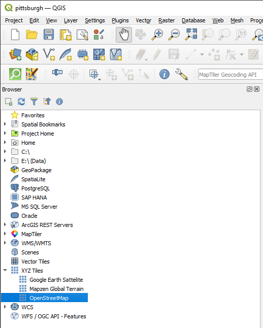

## Add center point based on chosen coordinates
Our chosen coordinates are the coordinates provided by Wikipedia/[GeoHack](https://geohack.toolforge.org/geohack.php?pagename=Allegheny_County_Courthouse&params=40.4384_N_79.9961_W_region:US-PA_type:landmark) for the Allegheny County Courthouse in Pittsburgh:

| X | Y |
| --- | --- | 
| -79.9961 | 40.4384 |


Navigate to `Layer -> Create Layer -> New GeoPackage Layer...`

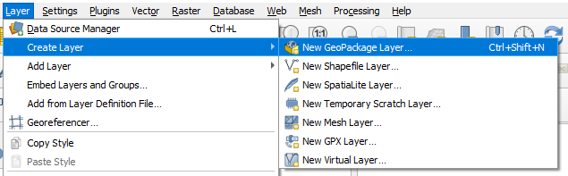

In the resulting New GeoPackage Layer dialog:
1. Click the three dots next to the Database field and choose where to save the file. I choose `center-geo.gpkg` as my naming convention to identify that this layer will be in a Geographic Coordinate Reference System (CRS)
2. Change the Geometry type field to Point
3. Change the dropdown underneath Geometry type to EPSG:4326 - WGS 84 (if it is not already)
4. Click OK

:::tip
Saving the each file to disk is an important part of the process. If you do not do this, QGIS will create temporary layers that will not be able to be used the next time the project is open.
:::

:::note
Using EPSG:4326 for the geographic center point ensures that we can enter exact latitude and longitude coordinates for our center point. Later in the tutorial, we will convert this into a layer that allows the use of meters for measurement.
:::

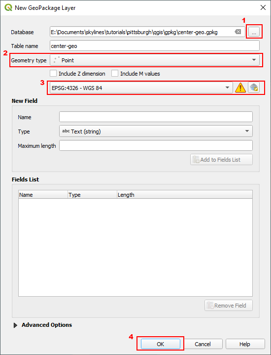

There should now be a new layer in your project called center-geo, located in the Layers panel:

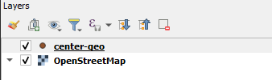

With the center-geo layer selected, navigate to the [Toolbar](https://docs.qgis.org/3.28/en/docs/training_manual/basic_map/overview.html#ls-an-overview-of-the-interface):
- Click on Toggle Editing , which will allow us to edit the layer
- Click on Add Point Feature 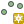
- Click anywhere in the Map Canvas (where OSM should be showing a world map) to add a point to the map, and enter 001 in the fid field in the pop-up that appears
- Click Vertex Tool  and right click on the point that was just created

This will open up the Vertex Editor in the lower left side of the QGIS application: 

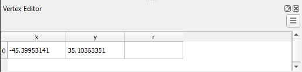

- Paste in the coordinates for Pittsburgh referenced above
- Click Save Layer Edits 
- Click Toggle Editing again to turn off editing
- Zoom in on the map and click Zoom To Layer  to center the Map Canvas on the center point

We now have a center point at the exact coordinates we want. In the next section of the tutorial, we will reproject the center and create buffers for the playable and total areas of the map. 

## Reproject center point to Projected Coordinate Reference System
:::note
This section is a little bit circular. In order to project the center point into the proper coordinate system, we need to know the projected CRS our project will ultimately use. To accomplish this we'll examine the metadata of a single DEM tile in our region of interest to find the proper CRS.
:::

### Determining your projected CRS

To determine our local projected CRS, first we need to identify the specific Universal Transverse Mercator (UTM) **Zone** in which our region of interest lies

- Navigate to mangomap's [What UTM Zone am I in?](https://mangomap.com/robertyoung/maps/69585/what-utm-zone-am-i-in-#) interactive web map and zoom in to Pittsburgh to find our UTM zone: `17N`

Now we will find the specific local projected CRS needed by our USGS DEM tiles within UTM Zone 17N

- Navigate to the [USGS National Map downloader](https://apps.nationalmap.gov/downloader/) and zoom in to Pittsburgh
- On the left-hand side check Elevation Products, and uncheck everything except for 1 meter DEM, and click Search Products

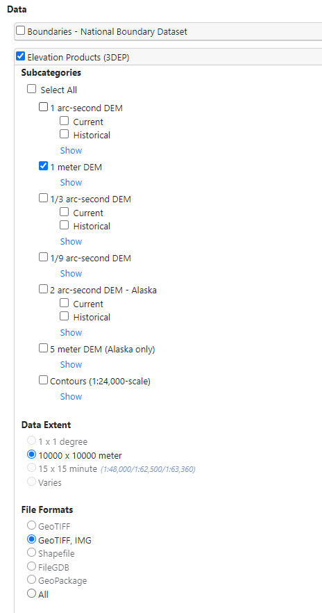

- Click the [Info/Metadata](https://www.sciencebase.gov/catalog/item/61a5bf42d34eb622f69755b7) link for the `USGS 1 Meter 17 x58y448 PA_WesternPA_2019_D20` file to find a summary description. We have two key take-aways from this summary:
> The spatial reference used for tiles of the one-meter DEM within the conterminous United States (CONUS) is Universal Transverse Mercator (UTM) in units of meters, and in conformance with the North American Datum of 1983 (NAD83).

> Each tile is distributed in the UTM Zone in which it lies.

All USGS 3DEP one-meter DEM tiles are conformed spatially to NAD83 for the specific UTM Zone in which a given tile lies. We already know our UTM Zone is `17N`, so now we have all the information we need to find our ideal CRS for Pittsburgh.

A quick [epsg.io search](https://epsg.io/?q=NAD83+UTM+Zone+17N) for `NAD83 UTM Zone 17N` gives us [EPSG:26917](https://epsg.io/26917) "NAD83 / UTM zone 17N"

If you'd like to double-check that this is the ideal CRS to work in, you can review the product metadata:

- From the same [Info/Metadata page](https://www.sciencebase.gov/catalog/item/61a5bf42d34eb622f69755b7) as before, click the [Product Metadata](https://thor-f5.er.usgs.gov/ngtoc/metadata/waf/elevation/1_meter/geotiff/PA_WesternPA_2019_D20/USGS_1M_17_x57y448_PA_WesternPA_2019_D20.xml) link in the Related External Resources section
- Search for `UTM zone 17N` within the text of this xml file to find `<gridsysn>NAD83 / UTM zone 17N</gridsysn>`
- "NAD83 / UTM zone 17N" is the exact name of [EPSG:26917](https://epsg.io/26917)

:::warning
Unfortunately, full product metadata is not available for all USGS 3DEP DEM tiles. If confirming the CRS via metadata inspection is not possible with the particular geodata for your region of interest, you can proceed with the next CRS confirmation method of downloading a tile and verifying CRS in QGIS directly.
:::

If you'd like to *triple*-check that `EPSG:26917` is where we want to end up, you can download the `.tif` file for this DEM tile and check it in QGIS:

- Click the Download Link (TIF) for the `USGS 1 Meter 17 x58y448 PA_WesternPA_2019_D20` file ([direct link](https://prd-tnm.s3.amazonaws.com/StagedProducts/Elevation/1m/Projects/PA_WesternPA_2019_D20/TIFF/USGS_1M_17_x58y448_PA_WesternPA_2019_D20.tif))
- After the file has finished downloading, locate it in your downloads, and drag and drop it in to the QGIS project

:::note
When you drag the file in to QGIS you may get a series of pop-ups saying multiple transformations are possible. This is okay. QGIS is trying to figure out how to show you your layers in a logical way. You can click OK to each of these pop-ups, and we'll correct the project CRS in the next step.
:::

In the layers panel, hover over the new USGS layer, and take note of the EPSG it lists (26917):

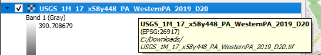

- After taking note of the EPSG, right click on the layer and select Remove Layer. You can then delete this file from your downloads (we'll re-download it later with all of the needed tiles)

### Changing the project CRS
In the far bottom right corner of the QGIS application, there is a button that displays the project CRS 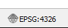, click on this button

In the Project Properties dialog that pops up:
1. Type `26917` in the Filter field
2. In the Predefined Coordinate Reference Systems box (second on the dialog), click the carrot next to Projected, and again next to Universal Transverse Mercator
3. Select NAD83 / UTM zone 17N EPSG: 26917
4. Click OK

:::note
You may get another pop-up about multiple transformations. Again just click OK. This is only changing the way your point layer appears, but not the data. Since it is just a point, there should be no distortion.
:::

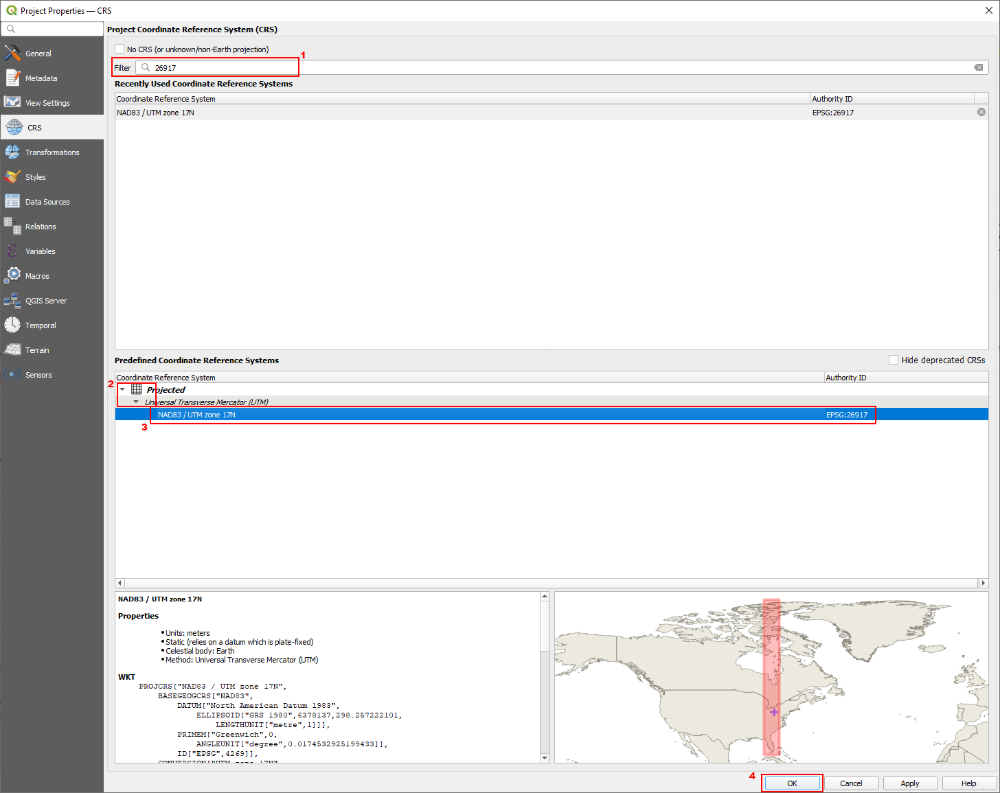

Your layers panel should now just have two layers, OpenStreetMap and center-geo.

### Reprojecting the center point
With the center-geo layer selected, navigate to `Vector -> Data Management Tools -> Reproject Layer...`: 

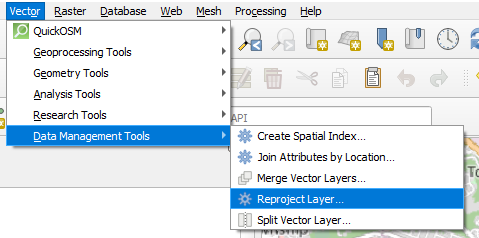

And in the resulting dialog:
1. Ensure the Input layer is center-geo
2. Set the Target CRS to Project CRS: EPSG:26917 - NAD83 / UTM zone 17N
3. Click the three dots next to the Reprojected field and save the new layer to disk as `center-projected`
4. Click run

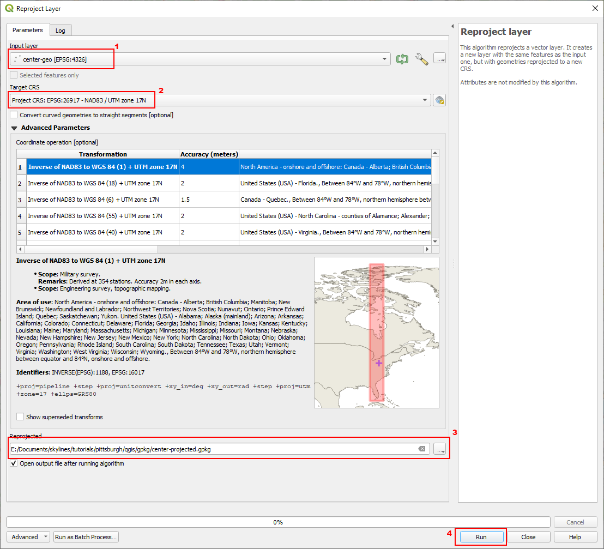

You should now have a new layer called center-projected in your Map Canvas. It will be directly on top of the center-geo (which you can check by toggling the eye icon next to each layer)

## Create total and playable area buffers

:::note
The following steps are repeated twice, with the only difference being the meter value entered in the Distance field. I will only list the steps once
:::

With the center-projected layer selected, navigate to `Vector -> Geoprocesing Tools -> Buffer`

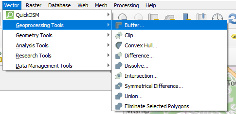


And in the resulting dialog:
1. Enter `7168` in the Distance field (half of playable side length, `28672` for total playable)
2. Change End cap style to Square
3. Change Join style to Miter
4. Select the three dots next to the Buffered field to save to disk. I name them `buffer-playable` and `buffer-total`
5. Click Run

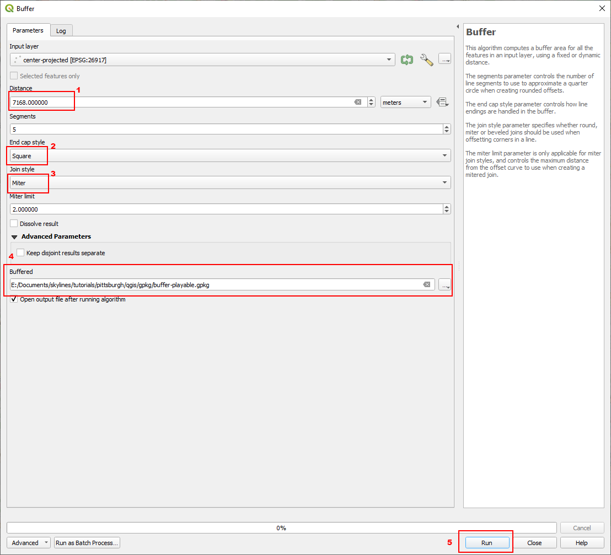

Repeat the same process for the total buffer (using `28672` for Distance). Once you have the buffer-total layer, select in the Layers panel and click Zoom To Layer.

:::tip
The default style of buffers is filled. I like to change this to just an outline so I can see what's inside of the buffer. To do this, double click the layer in the Layers panel to bring up the layers properties, select symbology, and click one of the outline options.
:::

After you done this, your Map Canvas should look like this:

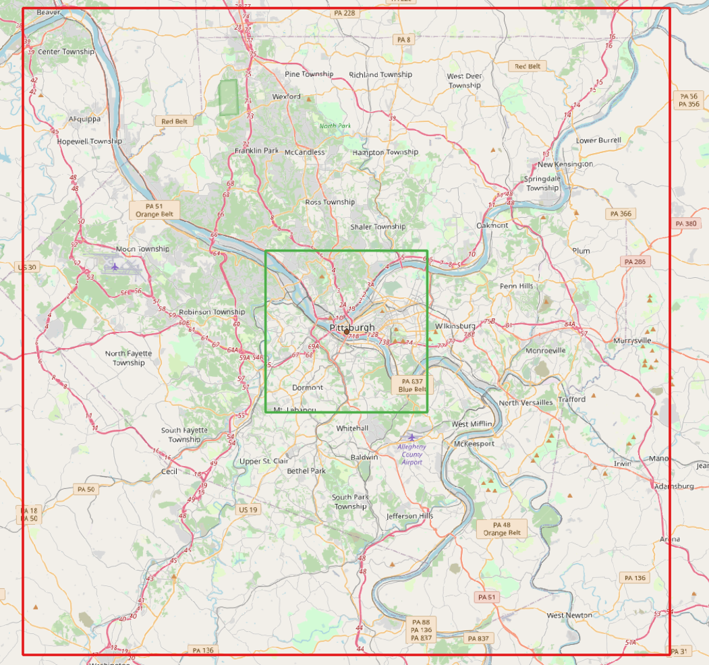

## Download DEMs from USGS
Before we can go to USGS to download data, we need to find the coordinates for the extent of our total area buffer. At the moment, this layer is in a projected coordinate system, which does not have latitude and longitude.

### Gather geographic coordinates for the total area buffer
The USGS downloader allows us to enter specific latitude and longitude coordinates to define the extent we want to search in (will be covered later). To gather this data, we will reproject the buffer-total layer back in EPSG:4326 (I am excluding screenshots as the process is the same as [reprojecting the center point](#reprojecting-the-center-point)). With the buffer-total layer selected:
- Navigate to `Vector -> Data Management Tools -> Reproject Layer...`
- Target CRS = 4326
- Run

:::tip
Saving this layer is optional. I usually delete it later since we will have the DEMs after we're done with this layer. If you wish to keep the data for the geographic coordinates of the total buffer, save this layer as well.
:::

After reprojecting the total buffer back in to 4326, you should have a new square that directly overlaps the buffer-total layer. Double click on the reprojected layer to bring up the Layer Properties, and click on Information. From the layer properties, we want to note down the Extent data points from the Information from provider section:

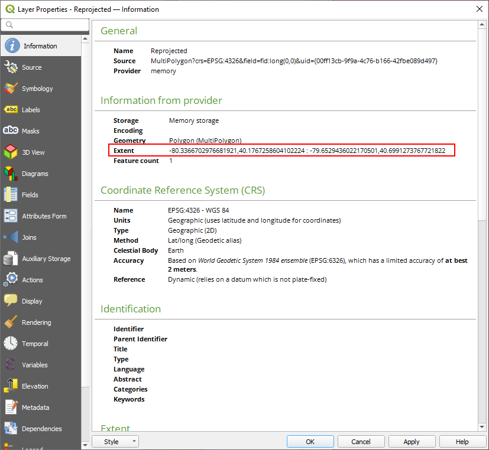

| Data point | Coordinate |
| --- | --- |
| X max | -79.6529436022170501 |
| X min | -80.3366702976681921 |
| Y max | 40.6991273767721822 |
| Y min | 40.1767258604102224 |

### Downloading DEMs based on our extent

:::warning
DEM files are large (300MB+ each at this resolution). The total download size resulting from this section is **greater than 15.3GB**. Please ensure you are able to download this quantity of data before continuing.
:::

Navigate back to the [USGS National Map downloader](https://apps.nationalmap.gov/downloader/), and make sure the same options as before are selected (just Elevation Products and 1 meter DEM). Click on Enter Coords next to Area of interest, and fill in the resulting form with the four points noted from the layer properties above. If done correctly, it should draw an extent on the map as in the last screenshot: 

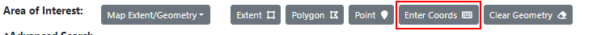

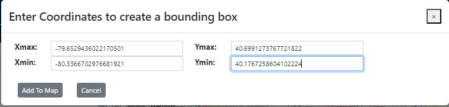

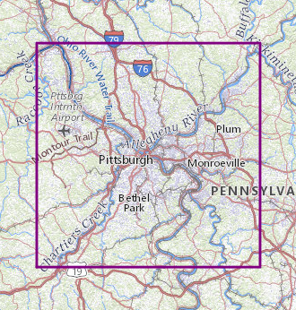


Click Search Products. There should be 49 results. Click the Cart icon at the top of the page to add all of the files to your cart. Navigate to the Cart tab, click the TXT icon to download a text file containing the links to the file, and then follow the instructions in the uGet Instructions link from USGS. I downloaded them into the src folder in the file tree from [above](#project-setup).

:::tip
Links to each individual file are also provided [in this repository](https://github.com/shankscs2/cs2-qgis-tutorials/blob/main/data.txt). uGet instructions are located [here](https://apps.nationalmap.gov/uget-instructions/index.html). You can, of course, download each file manually but that is a lot of clicking and margin for error.
:::

After your DEM tiles have finished downloading, the buffer-total that was reprojected above can be deleted (i.e., vector layer that is in EPSG:4326).

## Build Virtual Raster from DEM source files
Navigate to `Raster -> Miscellaneous -> Build Virtual Raster...`:

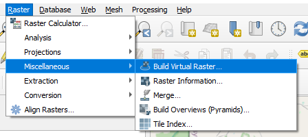

And in the resulting dialog:
1. Click on the three dots next to the Input Layers field
2. Select Add Files
3. Select all of the DEM files that were just downloaded from USGS
4. Click the blue arrow on the top left
>[!WARNING]
> I advise not clicking Run from this screen. Building the virtual raster can take some time, and it's best to build and save it at the same time. If you do click run before specifying a save location, you can right click the layer in the Layer panel and save from there.
5. Click the three dots next to the Virtual field and select a location to save the virtual raster file (I named mine `pitt-vrt`)
6. Click run

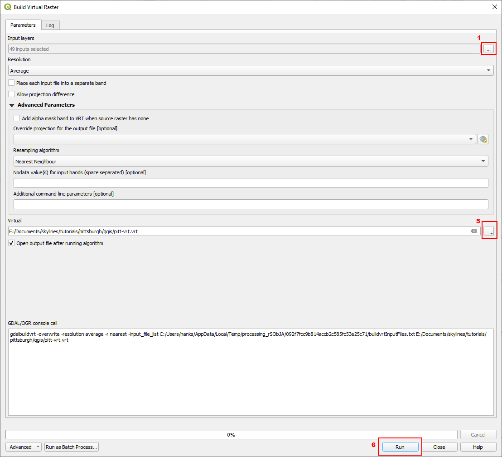

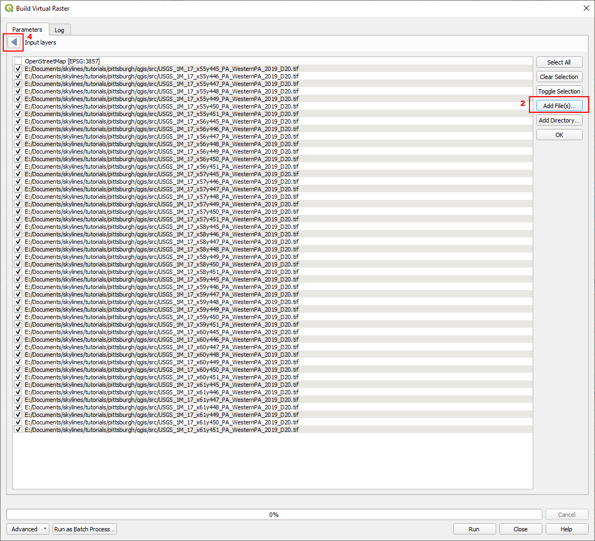

Building the virtual raster may take some time, depending on your hardware. Once it is finished, it will show up in the Layers panel with the name you provided. I like to still be able to see the buffers, so I click and hold on the `pitt-vrt` layer and drag it below the two buffer layers. 

## Clip virtual raster by total buffer
With the `pitt-vrt` layer selected, navigate to `Raster -> Extraction -> Clip Raster by Extent...`:

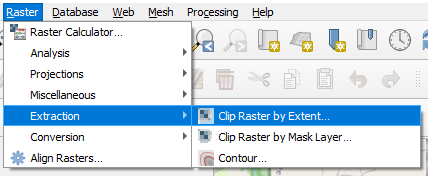

And in the resulting dialog:
1. Clip the dropdown next to the Clipping extent field and select Calculate from Layer, and select the buffer-total vector layer
2. Click the three dots next to Clipped (extent) and choose a location to save the file. Save as a `.tif` format (it should be the top option). I save mine as `pitt-dem.tif`
3. Click Run

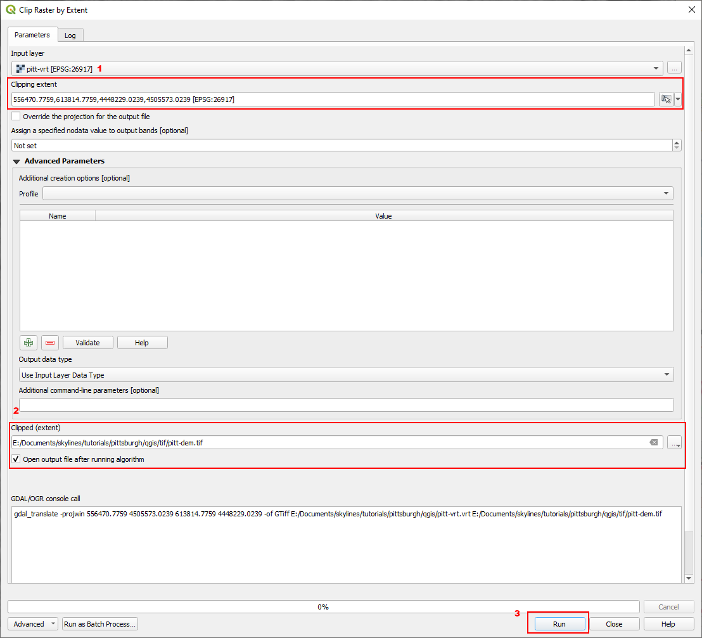

:::note
The clipping process may take a while to run. Just let QGIS work on it and it will tell you when it's complete.
:::

:::note
This will create a DEM that covers the total map area. If you wish to create one that only covers the playable area, select buffer-playable in step 1 above.
:::

If you have followed the steps, you should have a layer called pitt-dem that fits exactly inside of the buffer-total vector layer. Congratulations, you've created the DEM necessary to convert to a heightmap for use in Cities: Skylines II! Now we can get to converting it into the proper format.

## Converting to PNG
Your DEM should be exported as an unsigned 16-bit (UInt16) PNG. The resolution of the in-game terrain is 3.5m x 3.5m in the playable area, and 14m x 14m for the world area. As a result, both of the heightmaps that you export should be 4096x4096:

$14336 / 3.5 = 4096$

$57344 / 14 = 4096$

QGIS natively supports exporting DEMs to PNG through the Raster -> Conversion -> Translate (Convert Format...) option in the Menu Bar. In the Translate (Convert Format) dialog box:
1. Ensure the Input layer selected is the one you wish to export
2. Add `-scale [min] [max] 0 65535 -outsize 4096 4096 -r [resampling_method]` to the Additional command-line parameters field
3. Change Output data type to `UInt16`
4. Select a location to save the file
5. Optionally, uncheck Open output file after running algorithm. The resulting heightmap will have no geospatial information, so it isn't necessary to keep in QGIS
6. Click OK

### 
Additional command-line parameters explanation:
- `[min]` and `[max]` should be replaced with two numbers that cover a 4096 wide range. In our case, 0 4096 works because our map has its lowest elevation point at ~200m. This leaves plenty of room for tunnels below the terrain. In a case where the lowest elevation is less than ~100m, I recommend something like -100 3996 which should effectively raise your heightmap by 100 meters. 
- `[resampling_method]` should be one of the options available in QGIS. I have been using `cubic` with good results, however I encourage you to read about each of the methods, the sames of which can be found [here](https://docs.qgis.org/3.28/en/docs/user_manual/working_with_raster/georeferencer.html#define-the-resampling-method).

#### Sample properly formed command line parameters:

```cmd
-scale 0 4096 0 65535 -outsize 4096 4096 -r cubic
```

#### Sample if DEM does not have sufficient minimum elevation

```cmd
scale -100 3996 0 65535 -outsize 4096 4096 -r cubic
```

## Creating an overlay
Rick click the OpenStreetMap layer in the Layers panel and select Export -> Save As. In the resulting dialog:
1. Uncheck Create VRT
2. Click the three dots next to File name and provide a file name
3. Change the CRS to the Project CRS 26917
4. Click the Layer next to Calculate From and select buffer-playable
5. Click the Columns radio button and enter 16,384 (or your desired resolution for the overlay)
:::tip
The greyed out Horizontal boxes should show values that are equal to each other if you are in the correct CRS. If these values are different, check the CRS again.
:::

6. Uncheck Add saved file to map
7. Click OK

This process will also take a while. Give QGIS plenty of time and it will eventually finish up. You'll then need to convert the heightmap to PNG. I suggest using high compression (PNG has lossless compression) because the resulting TIF is very large (800MB+).


## The End
That's it. You should have a heightmap file and an overlay file that will fit perfectly in the dimensions of Cities: Skylines II. 

This is effectively the minimum to produce a heightmap. There is additional processing that can be done in QGIS (e.g., adding bathymetry data for sea floor detail, burning streams for better hydrology, burning lakes and other bodies of water), but those are outside of the scope of this tutorial. 

If you've made it this far, consider joining this [Cities: Skylines Modding](https://discord.gg/JbmmWQUcuV) Discord server. There are channels dedicated to QGIS/map making where you can ask questions and share your creations. 

Thanks to AmiPolizeiFunk and Truck from that server for collaborating on creating maps using QGIS, and providing insight and feedback on the methods presented in this tutorial. 

Map services and data available from U.S. Geological Survey, National Geospatial Program.